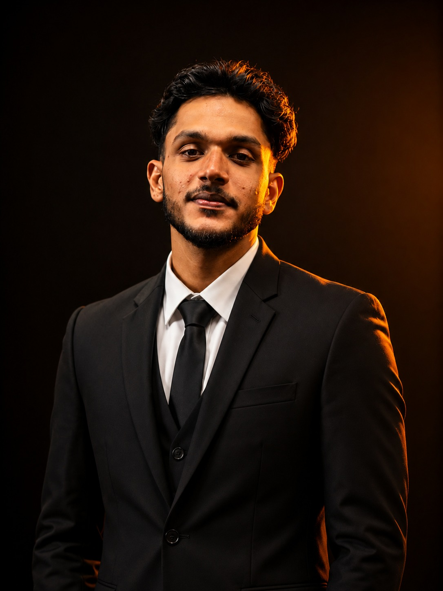

<!-- Animated wave banner -->

<!-- Avatar -->

<!-- Typing animation -->

 

## About me

I design and build full products end to end — backend APIs, web frontends, and mobile apps — for local and international clients. I like taking a rough idea and turning it into something people actually use.

- 🔭 Currently building CRM, POS, and client web platforms
- 🧠 Exploring: cleaner API architecture, offline-first apps, and AI-assisted workflows
- ⚡ Tool of choice: Cursor AI as a daily coding assistant
- 🌱 Always learning — right now digging into new tooling and frameworks on the side
- 📍 Based in Sri Lanka, working with clients worldwide

 

## Stack

 

## What I'm working with

<table>
<tr>
<td width="50%" valign="top">

**Backend**
- Laravel (REST/JSON APIs)
- MySQL, multi-tenant architecture
- Auth, billing, and admin systems

</td>
<td width="50%" valign="top">

**Frontend / Mobile**
- Next.js + Tailwind for web
- React Native for mobile
- Focus on clean, fast, usable UI

</td>
</tr>
</table>

 

## GitHub stats

 

 

